# Autonomous Exoplanetary Digital Twin

A real-time, browser-based climate-surrogate explorer for exoplanets, inspired by GCM literature and digital-twin concepts. Built for the HACK-4-SAGES hackathon.

## Table of Contents

- [Autonomous Exoplanetary Digital Twin](#autonomous-exoplanetary-digital-twin)
  - [Table of Contents](#table-of-contents)
  - [System Architecture](#system-architecture)
  - [Data Flows](#data-flows)
    - [1) User query to simulation output](#1-user-query-to-simulation-output)
    - [2) Catalog ingestion and augmentation pipeline](#2-catalog-ingestion-and-augmentation-pipeline)
    - [3) Runtime degradation cascade](#3-runtime-degradation-cascade)
  - [What it does](#what-it-does)
  - [Runtime Profiles](#runtime-profiles)
  - [Requirements](#requirements)
  - [Quick start](#quick-start)
    - [1. Clone and create a virtual environment](#1-clone-and-create-a-virtual-environment)
    - [2. Install Python dependencies](#2-install-python-dependencies)
    - [3. Install and configure Ollama](#3-install-and-configure-ollama)
    - [4. Train the models](#4-train-the-models)
    - [5. Launch the application](#5-launch-the-application)
  - [How to use the app](#how-to-use-the-app)
    - [Agent AI](#agent-ai)
    - [Manual Mode](#manual-mode)
    - [Catalog](#catalog)
    - [Science](#science)
    - [System](#system)
    - [About us](#about-us)
  - [Advanced training options](#advanced-training-options)
      - [PINNFormer physics modes](#pinnformer-physics-modes)
  - [Project structure](#project-structure)
  - [Docker deployment](#docker-deployment)
  - [Graceful degradation levels](#graceful-degradation-levels)
  - [Running tests](#running-tests)
  - [Tech stack](#tech-stack)

---

> **Scope & Non-Goals:** The ML surrogates (ELM ensemble, PINNFormer 3D) are trained on
> analytically generated data and are **not** calibrated against full 3-D General
> Circulation Models (ROCKE-3D, ExoCAM). Outputs are hypothesis-generating
> approximations intended for rapid triage and education, not peer-review-grade
> climate predictions. The system does not implement bidirectional data
> assimilation and is therefore a *digital-twin-inspired* surrogate, not a
> classical digital twin.

## System Architecture

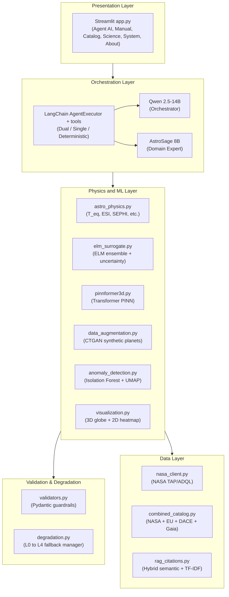


## Data Flows

### 1) User query to simulation output

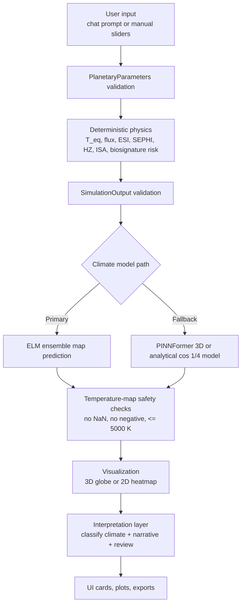

### 2) Catalog ingestion and augmentation pipeline

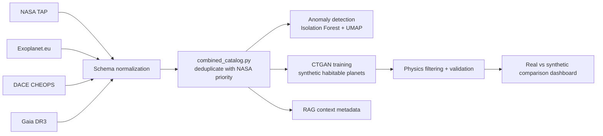

### 3) Runtime degradation cascade

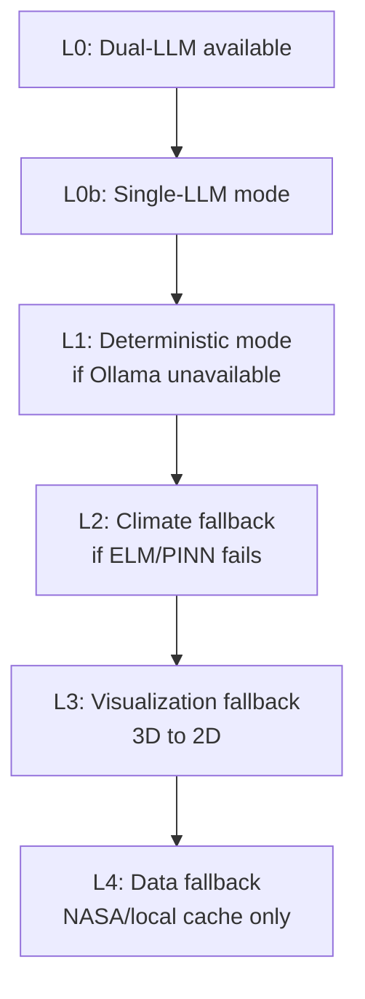

## What it does

- **Query NASA** — pull real observational data for any confirmed exoplanet via the TAP protocol.
- **Multi-archive catalog** — combined catalog integrating NASA Exoplanet Archive, Exoplanet.eu, DACE (Geneva/CHEOPS), and Gaia DR3 into a unified, de-duplicated dataset.
- **Compute habitability** — equilibrium temperature, Earth Similarity Index (ESI), Surface Exoplanetary Habitability Index (SEPHI, Rodríguez-Mozos & Moya 2017), habitable-zone boundaries (Kopparapu 2013), habitable surface fraction.
- **ISA interaction modeling** — Interior-Surface-Atmosphere coupling assessment including volcanic outgassing, plate tectonics likelihood, and carbonate-silicate cycle.
- **Biosignature false-positive mitigation** — UV flux estimation and photochemical false-positive risk analysis to distinguish biological from abiotic signatures.
- **Predict climates** — an ensemble of Extreme Learning Machines (ELM) predicts 2-D surface temperature maps in milliseconds with conformal prediction uncertainty intervals.
- **GCM benchmark comparison** — 3 synthetic GCM reference profiles (Earth-like aquaplanet, Proxima b tidally locked, Hot rock) for qualitative validation of surrogate outputs.
- **Anomaly detection** — Isolation Forest identifies statistically unusual planets in the NASA catalog; UMAP provides 2-D population visualization with "weirdest planets" ranking.
- **Augment data** — a CTGAN synthesises thousands of physically plausible habitable-planet configurations to fix the extreme class imbalance in real catalogs. A real-vs-synthetic comparison dashboard visualises distributions.
- **3-D visualisation** — interactive Plotly globe with rotation animation, scientific colour-mapping, host-star marker, and 2-D heatmap fallback.
- **Planetary Soundscape** — sonification of the equatorial temperature profile for outreach and accessibility.
- **LLM agent** — a LangChain agent with configurable single-LLM or dual-LLM mode (Qwen 2.5-14B orchestrator + AstroSage-Llama-3.1-8B domain expert), multi-turn memory, 11 tools, and autonomous domain-expert consultation.
- **AstroSage domain expert** — a fine-tuned astrophysics LLM ([AstroMLab/AstroSage-Llama-3.1-8B](https://huggingface.co/AstroMLab/AstroSage-Llama-3.1-8B-GGUF)) that interprets simulation results, classifies climate states, reviews physics plausibility, and provides scientific narratives. It never computes physics itself — it reads deterministic tool outputs.
- **RAG citations** — ChromaDB vector store of 40 peer-reviewed astrophysics papers with hybrid retrieval (semantic + TF-IDF + Reciprocal Rank Fusion), 6 scientific domain tags for filtering, and graceful degradation to TF-IDF-only if ChromaDB is unavailable.
- **Physics guardrails** — Pydantic validators reject any output that violates thermodynamic or astrophysical constraints.
- **Graceful degradation** — a 5-level fallback cascade (L0 → L4) ensures the app never crashes. See [Graceful degradation levels](#graceful-degradation-levels) for details.

## Runtime Profiles

| Profile | What it needs | What works |
|---------|--------------|------------|
| **Deterministic** | Python + pip dependencies | Physics, ELM surrogate, PINNFormer, visualization, CSV export |
| **Single-LLM** | + Ollama + AstroSage-8B (~5 GB) | + AI narratives, chat agent, ADQL generation (AstroSage handles both roles) |
| **Dual-LLM** | + Ollama + Qwen 2.5-14B (~9 GB) + AstroSage-8B (~5 GB) | + Separate orchestrator and domain expert (recommended for demos) |

Select the mode in the **System** tab. The app degrades gracefully: if Ollama is unavailable, all physics/ML tools remain functional.

## Requirements

| Component | Minimum | Recommended |
|-----------|---------|-------------|
| Python | 3.10 | 3.11 |
| RAM | 8 GB | 16 GB |
| GPU | — | NVIDIA RTX with 8+ GB VRAM (CUDA) |
| Disk | 5 GB | 15 GB (includes LLM weights) |
| Ollama | latest (for LLM modes) | latest |

## Quick start

### 1. Clone and create a virtual environment

```bash
git clone <repo-url>
cd Hack-4-Sages

python -m venv .venv

# Windows PowerShell
.\.venv\Scripts\Activate.ps1

# Linux / macOS
source .venv/bin/activate
```

### 2. Install Python dependencies

```bash
pip install -r requirements.txt
```

If you have an NVIDIA GPU and want CUDA-accelerated training (CTGAN, PINNFormer), install PyTorch with CUDA **before** the requirements:

```bash
pip install torch torchvision torchaudio --index-url https://download.pytorch.org/whl/cu124
pip install -r requirements.txt
```

For **AMD GPU on Linux** (ROCm), install the ROCm-enabled PyTorch build instead:

```bash
# Check your ROCm version first: rocminfo | grep 'ROCm'
pip install torch torchvision torchaudio --index-url https://download.pytorch.org/whl/rocm6.2
pip install -r requirements.txt
```

`torch.cuda.is_available()` returns `True` with ROCm PyTorch — the exact same code path is used for both NVIDIA and AMD GPUs.

### 3. Install and configure Ollama

Download Ollama from <https://ollama.com/download> and install it.

The system uses **two LLM models** served via Ollama:

| Model | Role | Base | VRAM |
|-------|------|------|------|
| `qwen2.5:14b` | Orchestrator — tool calling, routing, synthesis | Qwen 2.5-14B | ~9 GB |
| `astro-agent` | Domain expert — interpretation, classification, scientific narratives | [AstroSage-Llama-3.1-8B](https://huggingface.co/AstroMLab/AstroSage-Llama-3.1-8B-GGUF) (Q5_K_M GGUF) | ~5 GB |

```bash
# Pull the orchestrator model (~9 GB)
ollama pull qwen2.5:14b

# Create the AstroSage domain-expert model from the included Modelfile
# This downloads the AstroMLab/AstroSage-Llama-3.1-8B-GGUF weights automatically
ollama create astro-agent -f Modelfile.astrosage

# Verify both models are available
ollama list
```

**For Single-LLM mode** (lower VRAM): skip the `qwen2.5:14b` pull — AstroSage handles both orchestration and domain expertise.

Ollama automatically starts a local API server on `http://localhost:11434`. On NVIDIA GPUs it uses the CUDA backend by default.

> **Note:** `Modelfile.astro` is a legacy file that creates a Qwen 2.5-based model with a system prompt. It is **not** used by the current codebase. The code expects `qwen2.5:14b` (raw) and `astro-agent` (from `Modelfile.astrosage`).

### 4. Train the models

A single script trains everything and populates the `models/` directory:

```bash
# Fast default — trains ELM only (~5 seconds on CPU)
python train_models.py

# Full suite — ELM + CTGAN + PINNFormer (needs internet + GPU)
python train_models.py --ctgan --pinn
```

| Flag | What it trains | Time | Requirements |
|------|---------------|------|-------------|
| *(none)* | ELM ensemble | ~5 s | CPU |
| `--ctgan` | + CTGAN augmenter | ~5–15 min | Internet (downloads NASA catalog), GPU helps |
| `--pinn` | + PINNFormer 3-D | ~1–2 h | PyTorch, GPU strongly recommended, no internet needed |

The app works even without trained models — it falls back to an analytical model for climate maps. But running at least `python train_models.py` (ELM) gives much better predictions.

### 5. Launch the application

```bash
streamlit run app.py
```

The browser opens automatically at **http://localhost:8501**.

## How to use the app

The interface has the following main tabs:

### Agent AI

Type a question in natural language, for example:

- *"Analyze the habitability of TRAPPIST-1 e"*
- *"What conditions exist on Proxima Centauri b?"*
- *"Compare Kepler-442 b with Earth"*

The agent autonomously fetches NASA data, computes indices, and optionally runs the climate surrogate. The **Reasoning Chain** panel on the right shows every tool call the agent makes.

Use the **Explanation depth** toggle (Scientist / Outreach) to control how technical the response is.

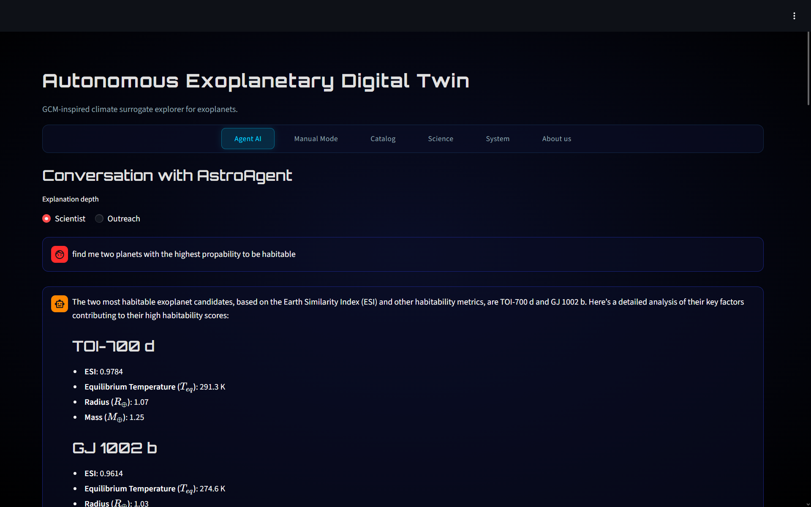

### Manual Mode

Drag the sliders to set stellar and planetary parameters, then press **Run Simulation**. A pipeline progress bar shows each step (Validate, Compute, Simulate, Analyse). Enable **Live "What If" mode** to see the globe update in real time.

Available parameter sliders: stellar temperature, stellar radius, planet radius, mass, semi-major axis, eccentricity, Bond albedo, tidal locking, surface type (mixed rocky / ocean / desert / ice), atmosphere type (thin / temperate / thick), C/O ratio, surface pressure, and atmosphere regime (H₂-rich / O₂-rich / CH₄-CO₂).

Select the **Climate model** to use: ELM Ensemble, PINNFormer 3-D, or Analytical fallback.

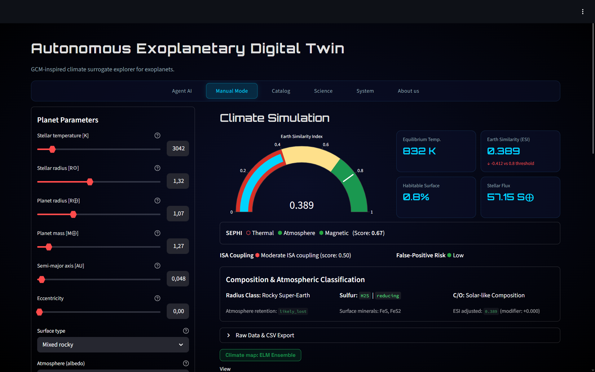

The panel shows:
- ESI gauge (0-1 scale with colour zones)
- SEPHI traffic lights (thermal / atmosphere / magnetic criteria)
- ISA Coupling score and Biosignature False-Positive risk badges
- Habitable Surface Fraction (HSF)
- Radius Gap classification (Fulton Gap proximity), Sulfur chemistry assessment, C/O ratio habitability modifier
- Interactive 3-D globe with rotation animation or 2-D heatmap
- AI Interpretation expander (domain expert analysis, climate classification, physics review)
- Raw data CSV export buttons for metrics and temperature maps

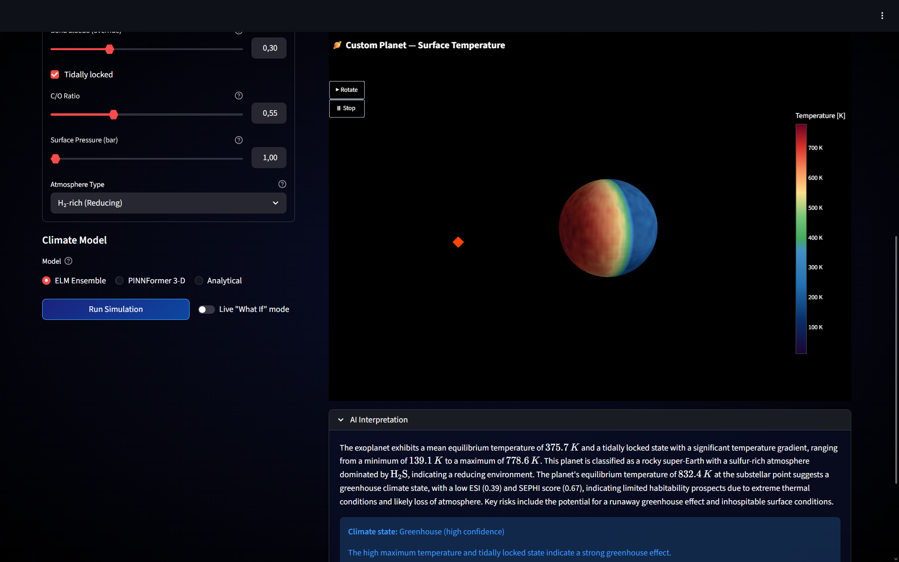

### Catalog

Browse the NASA Exoplanet Archive. Type a natural-language query (e.g. "rocky planets closer than 10 parsecs") and Qwen converts it to ADQL. Click famous-planet buttons for instant domain-expert summaries. **Fetch full catalog** runs anomaly detection and UMAP visualisation.

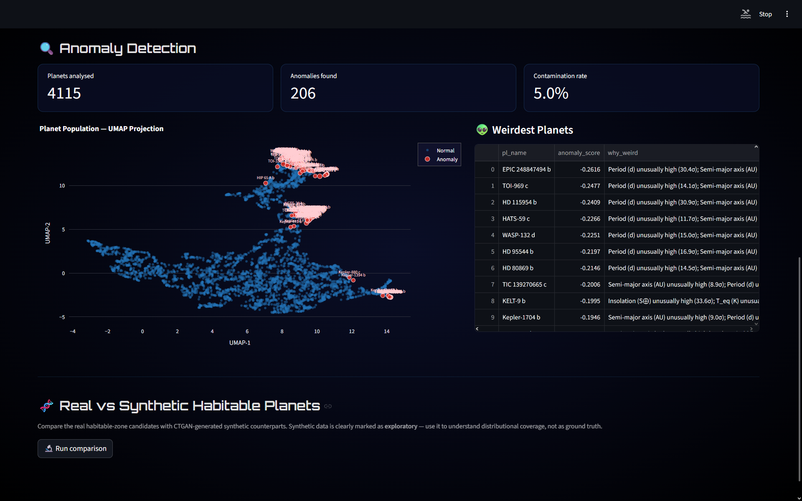
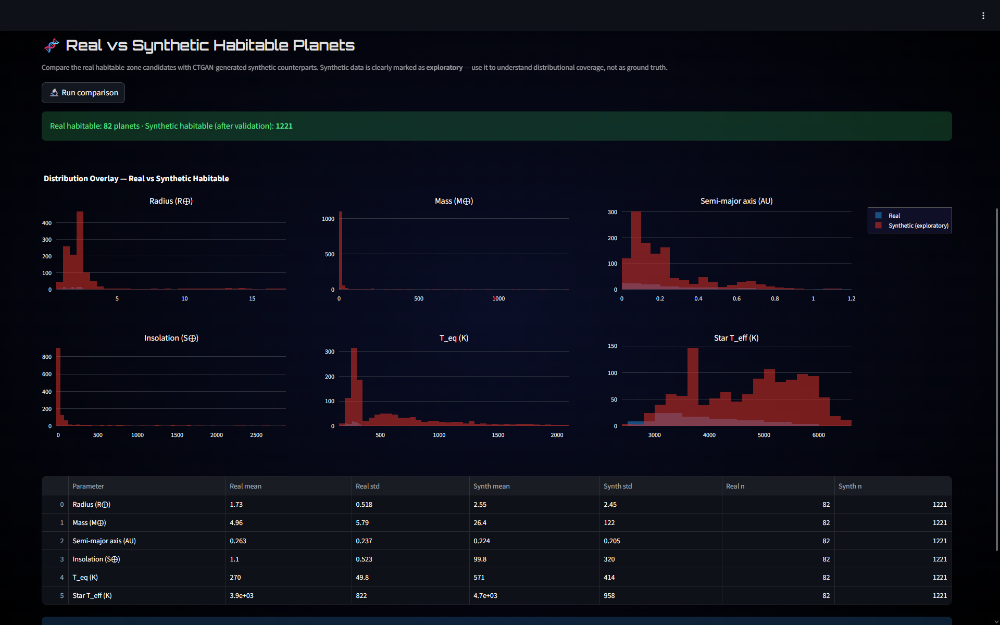

### Science

Available after running a simulation:
- **Scientific Narrative** — domain-expert paragraph explaining the results
- **Interior-Surface-Atmosphere assessment** — outgassing, plate tectonics, C-Si cycle
- **Photochemical false-positive analysis** — O2, CH4, O3 risk flags with UV flux
- **Habitable Zone diagram** — planet position relative to HZ boundaries
- **Terminator cross-section** — temperature profile along the day-night boundary
- **Conformal prediction intervals** — formal 90% coverage from ELM ensemble
- **GCM benchmark comparison** — pattern correlation, RMSE, bias, and zonal mean RMSE against 3 reference cases
- **Compare with Earth** — domain-expert side-by-side analysis
- **Planetary Soundscape** — sonification of the equatorial temperature profile

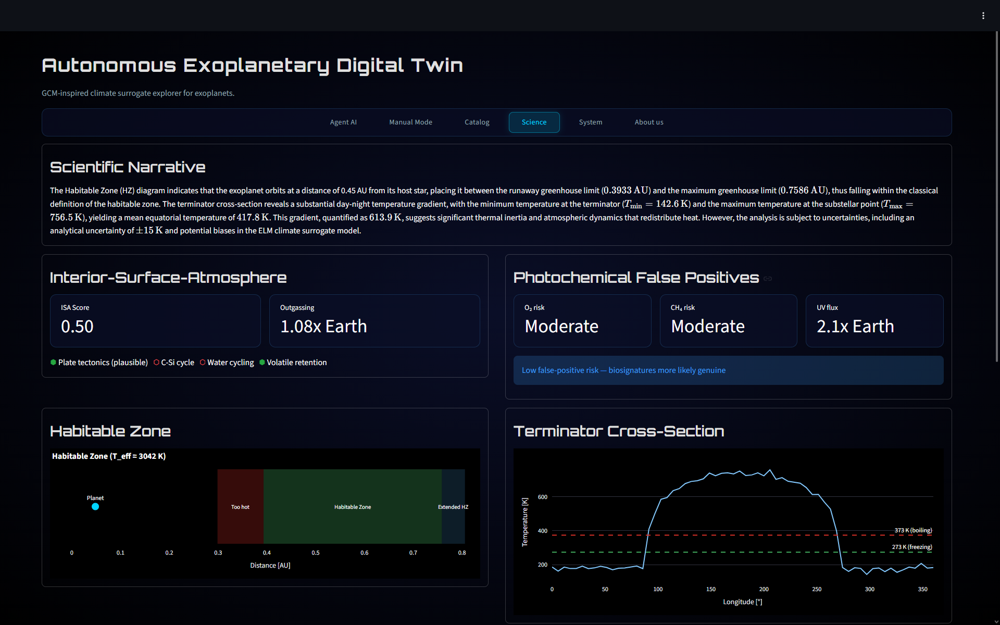

### System

- **LLM runtime mode selector** — switch between Dual-LLM, Single-LLM, and Deterministic modes
- **Temperature unit converter** — toggle between Kelvin and Celsius (persistent in session)
- **Self-Diagnostics** — tests NASA API, T_eq sanity, Pydantic validation, ELM model, PINNFormer, and Ollama
- **Architecture diagram** — full data pipeline visualisation (Mermaid)
- **Export** — download the 3-D globe as interactive HTML
- **Docker** — deployment instructions

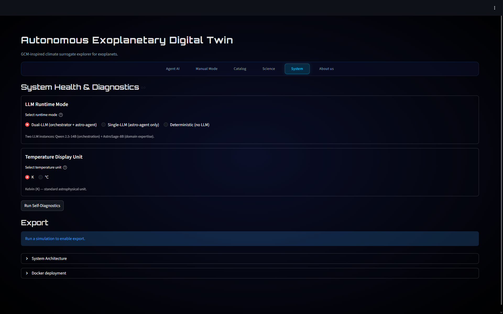

### About us

Project and team overview.

## Advanced training options

The `train_models.py` script accepts extra tuning flags:

```bash
python train_models.py --elm-samples 10000        # more training data for ELM
python train_models.py --ctgan --ctgan-epochs 500  # longer CTGAN training
python train_models.py --pinn --pinn-epochs 10000  # longer PINNFormer training
```

#### PINNFormer physics modes

The `--pinn-mode` flag selects which physics terms the PINNFormer loss includes:

| Mode | Physics enabled |
|------|-----------------|
| `basic` | Heat equation only |
| `greenhouse` | + optical depth |
| `oht` | + ocean heat transport |
| `clouds` | + cloud albedo feedback |
| `tidal` | + tidal heating |
| `ice_albedo` | + ice-albedo feedback |
| `advection` | + zonal wind |
| `oht_clouds` | Combined OHT + clouds |
| `full` | All physics terms |

```bash
python train_models.py --pinn --pinn-mode full    # all physics terms
python train_models.py --pinn --pinn-mode clouds   # cloud albedo feedback only
```

You can also train the lightweight 1-D PINN fallback (DeepXDE, CPU-friendly):

```python
from modules.pinn_heat import train_1d_pinn
model = train_1d_pinn(epochs=10000)
```

## Project structure

```
Hack-4-Sages/
├── app.py                      # Streamlit application
├── requirements.txt            # Python dependencies
├── Modelfile.astrosage         # Ollama model config — AstroSage domain expert
├── Dockerfile                  # Container deployment
├── METHODOLOGY.md              # Full scientific methodology document
├── train_models.py             # One-shot training script
├── modules/
│   ├── nasa_client.py          # NASA TAP API client
│   ├── astro_physics.py        # T_eq, ESI, SEPHI, HZ, ISA, false-positive analysis
│   ├── validators.py           # Pydantic physics guardrails
│   ├── elm_surrogate.py        # ELM ensemble with conformal prediction
│   ├── data_augmentation.py    # CTGAN augmentation pipeline
│   ├── combined_catalog.py     # Multi-archive catalog (NASA + EU + DACE + Gaia)
│   ├── agent_setup.py          # LangChain dual-model agent (11 tools)
│   ├── llm_helpers.py          # Standalone LLM helpers for each tab
│   ├── rag_citations.py        # Hybrid RAG (semantic + TF-IDF + RRF), 40 papers
│   ├── anomaly_detection.py    # Isolation Forest + UMAP
│   ├── visualization.py        # Plotly 3-D globe (rotation), 2-D heatmap, HZ
│   ├── degradation.py          # Graceful-degradation manager (L0–L4)
│   ├── gcm_benchmarks.py       # 3 synthetic GCM reference profiles
│   ├── model_evaluation.py     # ELM vs GCM, CTGAN stats, PINN diagnostics
│   ├── pinnformer3d.py         # PINNFormer 3-D (PyTorch, 9 physics modes)
│   └── pinn_heat.py            # DeepXDE 1-D PINN fallback
├── tools/
│   ├── data_fetch.py           # Gaia / Exoplanet.eu / DACE fetcher
│   └── build_combined_catalog_preview.py  # CSV preview builder
├── tests/                      # pytest test suite (72 tests)
│   ├── test_astro_physics.py   # Physics engine tests
│   ├── test_ctgan_physics.py   # CTGAN physical filters and stats
│   ├── test_degradation_and_modes.py  # Degradation + agent modes
│   ├── test_elm_gcm_evaluation.py     # ELM vs GCM benchmarks
│   ├── test_elm_surrogate.py   # ELM + conformal prediction tests
│   ├── test_pinn_validation.py # PINNFormer physics validation
│   ├── test_pinnformer_accuracy.py    # PINNFormer accuracy tests
│   ├── test_rag_citations.py   # RAG citation tests
│   └── test_validators.py      # Pydantic guardrail tests
├── models/                     # Trained model weights (.pkl, .pt)
├── data/nasa_cache/            # Cached NASA query results
├── notebooks/                  # Exploration notebooks
└── info_dump/                  # Research documents and reports
```

## Docker deployment

```bash
docker build -t exo-twin .

# Run with model weights mounted from the host (recommended for production)
docker run -p 8501:8501 --gpus all \
  -v $(pwd)/models:/app/models \
  exo-twin
```

Then open **http://localhost:8501**.

Note: Ollama must run separately or be added as a service in a `docker-compose.yml`. For long-term deployments, mount the `/app/models` directory as a Docker volume rather than baking mutable `.pkl`/`.pt` files into the image.

## Graceful degradation levels

The app implements a 5-level fallback cascade so it never crashes:

| Level | Trigger | Behaviour |
|-------|---------|----------|
| **L0** | Dual-LLM available | Full mode — Qwen orchestrator + AstroSage domain expert |
| **L0b** | Only AstroSage available | Single-LLM — AstroSage handles both roles |
| **L1** | Ollama unavailable | Deterministic tools only — no AI narratives |
| **L2** | ELM produces unphysical output | Analytical cos^(1/4) temperature model fallback |
| **L3** | 3-D render timeout | 2-D Mollweide heatmap fallback |
| **L4** | CTGAN / network failure | Local cache only — no augmentation |

## Running tests

```bash
python -m pytest tests/ -v
```

The test suite (72 tests across 9 files) covers:

| File | Scope |
|------|-------|
| `test_astro_physics.py` | T_eq, ESI, SEPHI, HZ boundaries, ISA, false-positive analysis |
| `test_ctgan_physics.py` | CTGAN physical filters and distribution statistics |
| `test_degradation_and_modes.py` | Graceful degradation cascade + agent runtime modes |
| `test_elm_gcm_evaluation.py` | ELM surrogate vs GCM benchmark comparison |
| `test_elm_surrogate.py` | ELM ensemble training, prediction, conformal intervals |
| `test_pinn_validation.py` | PINNFormer physics constraint validation |
| `test_pinnformer_accuracy.py` | PINNFormer prediction accuracy tests |
| `test_rag_citations.py` | RAG retrieval, hybrid search, citation formatting |
| `test_validators.py` | Pydantic guardrail rejection of unphysical inputs |

## Tech stack

| Layer | Technology |
|-------|-----------|
| Frontend | Streamlit |
| LLM orchestrator | Ollama — Qwen 2.5-14B |
| LLM domain expert | Ollama — AstroSage-Llama-3.1-8B (AstroMLab) |
| Agent framework | LangChain (11 tools, ReAct) |
| Climate surrogate | ELM (scikit-elm / NumPy) with conformal prediction |
| Data augmentation | CTGAN |
| Anomaly detection | Isolation Forest + UMAP |
| RAG | ChromaDB + Sentence Transformers |
| PINN | DeepXDE + custom PINNFormer (PyTorch) |
| Validation | Pydantic |
| Visualisation | Plotly |
| Data source | NASA Exoplanet Archive (TAP), Gaia DR3, Exoplanet.eu, DACE  |
| Testing | pytest (72 tests) |
